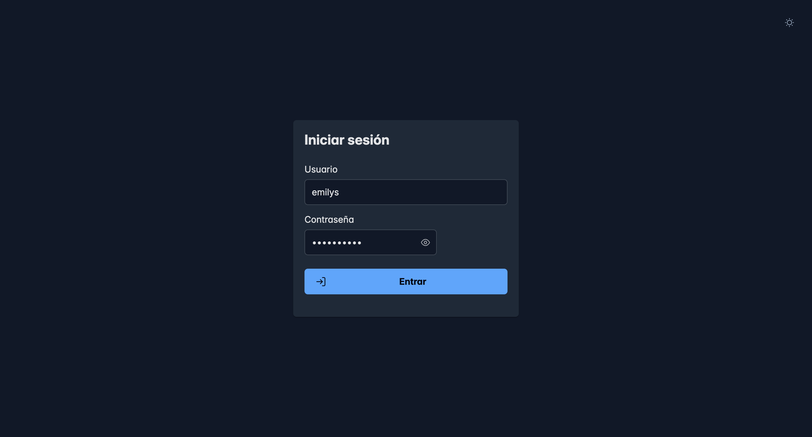
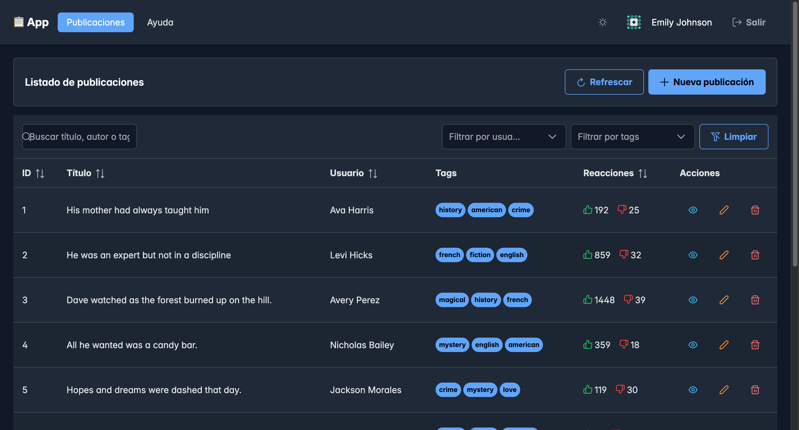
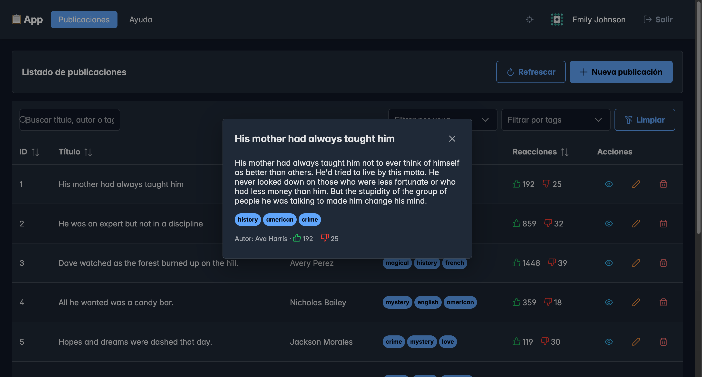
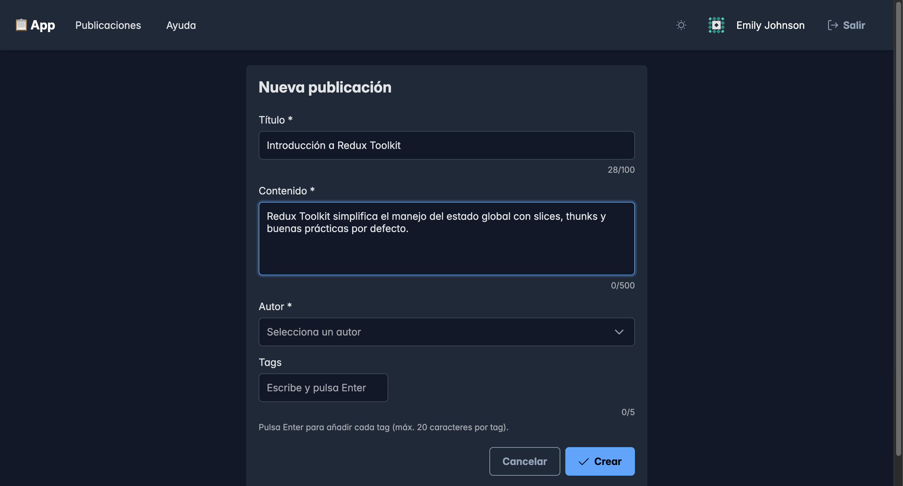
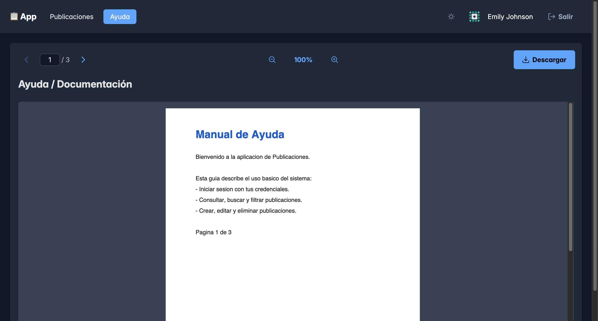
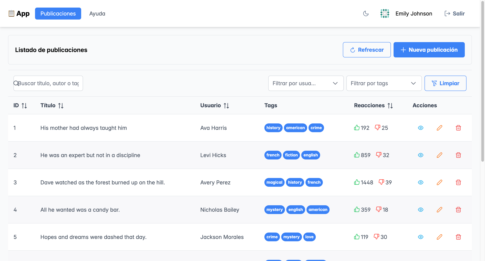

# 📋 SPA de Publicaciones — Examen Frontend Avanzado

Single Page Application desarrollada con **React + TypeScript + Redux Toolkit + PrimeReact**, que implementa autenticación JWT, un CRUD completo de publicaciones con tabla avanzada, formularios validados, visor de PDF y estado global.

La API de datos es la pública **[DummyJSON](https://dummyjson.com)**.

---

## 🚀 Stack técnico

| Herramienta                            | Uso                                  |
| -------------------------------------- | ------------------------------------ |
| **React 18 + TypeScript (estricto)**   | Base de la aplicación                |
| **Vite**                               | Build y servidor de desarrollo       |
| **Redux Toolkit + React Redux**        | Estado global (slices + thunks)      |
| **React Router DOM v6**                | Rutas públicas y privadas            |
| **PrimeReact + PrimeFlex + PrimeIcons**| Componentes UI y layout              |
| **Axios**                              | Peticiones HTTP (con interceptor)    |
| **react-hook-form**                    | Formularios y validaciones           |
| **react-i18next**                      | Internacionalización (ES / EN)       |
| **react-pdf**                          | Renderizado de PDF                   |
| **Vitest + Testing Library**           | Tests unitarios                      |
| **ESLint + Prettier**                  | Calidad y formato de código          |

---

## 🔑 Credenciales de acceso

> ⚠️ **Importante:** el enunciado indica `kminchelle / 0lelplR`, pero **DummyJSON actualizó sus usuarios** y esas credenciales ya no funcionan. El usuario válido actual es:

```
usuario:    emilys
contraseña: emilyspass
```

(El formulario de login ya viene precargado con estas credenciales.)

---

## 📸 Capturas del flujo principal

| Login | Tabla de publicaciones |
| ----- | ---------------------- |
|  |  |

| Ver detalle | Formulario (con contadores) |
| ----------- | --------------------------- |
|  |  |

| Visor de PDF | Modo claro |
| ------------ | ---------- |
|  |  |

---

## 📦 Instalación y scripts

```bash
npm install        # Instala dependencias

npm run dev        # Servidor de desarrollo (http://localhost:5173)
npm run build      # Build de producción (type-check + Vite build)
npm run preview    # Sirve el build de producción localmente

npm test           # Ejecuta los tests unitarios una vez
npm run test:watch # Tests unitarios en modo watch
npm run test:e2e   # Tests end-to-end con Playwright
npm run lint       # Analiza el código con ESLint
npm run format     # Formatea el código con Prettier
```

> La primera vez que corras los E2E, instala el navegador: `npx playwright install chromium`.

---

## 🧩 Funcionalidades (según la rúbrica)

1. **Autenticación** — Login con JWT, token guardado en Redux y persistido en `localStorage`, rutas protegidas (redirige a `/login` sin token) y logout que limpia todo.
2. **Tabla de publicaciones** — `DataTable` de PrimeReact con columnas ID/Título/Usuario/Tags/Reacciones/Acciones, búsqueda global, filtros por usuario (`Dropdown`) y tags (`MultiSelect`), paginación, y acciones Ver/Editar/Eliminar con `Toolbar`, `Toast` y `ConfirmDialog`.
3. **Formulario** — Crear y editar con `react-hook-form` + `Controller` (`InputText`, `InputTextarea`, `Dropdown`, `Chips`), validaciones, `POST /posts/add` y `PUT /posts/:id`.
4. **Visor de PDF** — Ruta `/docs` con `react-pdf`: ver, navegar entre páginas, zoom in/out y descargar. Controles con `Button` e `InputText`.
5. **Estado global** — Slices `auth`, `posts`, `users` y `ui` (toasts y loading global). Peticiones con `createAsyncThunk`.
6. **Calidad** — TypeScript estricto, ESLint + Prettier, accesibilidad básica y tests unitarios.

### ✨ Extras implementados

- **Internacionalización (ES / EN)** — Toda la interfaz está traducida con **react-i18next**. Un selector en la cabecera (y en el login) cambia el idioma en caliente; la elección se detecta del navegador la primera vez y se **persiste** en `localStorage`.
- **Modo oscuro / claro** — Toggle en la cabecera (y en el login) que intercambia el tema de PrimeReact (`lara-light-blue` ↔ `lara-dark-blue`) en caliente. La preferencia se persiste en `localStorage` y, la primera vez, respeta la del sistema (`prefers-color-scheme`). El tema se aplica antes del render para evitar parpadeo (FOUC).
- **Contadores en el formulario** — Título `n/100`, Contenido `n/500` y Tags `n/5`, más un límite de `20` caracteres por tag. Los límites se aplican también con `maxLength` para impedir excederlos.
- **Skeletons de carga** — La tabla muestra filas "fantasma" (`Skeleton`) durante la carga inicial, en lugar de una tabla vacía.
- **Persistencia global del estado** — Las publicaciones se guardan en `localStorage` y se rehidratan al arrancar (`preloadedState`), de modo que las creadas/editadas **sobreviven a un refresco**. Un botón **Refrescar** vuelve a traer datos del servidor cuando se desee.
- **Optimistic UI** — Editar y eliminar actualizan la tabla **al instante** (en la acción `pending`); si la API falla, se **revierte** el cambio al estado anterior (guardando un backup por id).
- **Tests E2E** — Playwright cubre el flujo principal (ruta protegida, login y búsqueda en la tabla).
- **Docker** — `Dockerfile` multi-stage (build con Node → servido con nginx) y `docker-compose.yml`.
- **Deploy** — Configuración lista para **Vercel** (`vercel.json`) y **Netlify** (`netlify.toml`) con el rewrite de SPA.

---

## 🐳 Docker

Build multi-stage: se compila con Node y se sirven los estáticos con **nginx** (con fallback a `index.html` para el enrutado de la SPA).

```bash
# Con docker-compose (recomendado)
docker compose up --build     # App en http://localhost:8080

# O manualmente
docker build -t proyecto-evaluacion .
docker run -p 8080:80 proyecto-evaluacion
```

---

## ☁️ Deploy

El proyecto incluye configuración lista para dos plataformas (ambas con el _rewrite_ a `index.html` que necesita una SPA):

- **Vercel** — `vercel.json`. Importa el repo en Vercel y desplega (detecta Vite automáticamente).
- **Netlify** — `netlify.toml` (`build = npm run build`, `publish = dist`).

---

## 🗂️ Estructura del proyecto

```
src/
├── api/axiosClient.ts          # Instancia de axios + interceptor que inyecta el token
├── app/
│   ├── store.ts                # Configuración del store de Redux (con preloadedState)
│   ├── persistence.ts          # Guarda/rehidrata el estado en localStorage
│   └── hooks.ts                # Hooks tipados (useAppDispatch / useAppSelector)
├── theme/                      # Modo claro/oscuro (theme.ts + useTheme.ts)
├── i18n/                       # Internacionalización (config + locales es/en)
├── features/                   # Un módulo por dominio (arquitectura por features)
│   ├── auth/                   # authSlice, tipos y tests
│   ├── posts/                  # postsSlice (CRUD), tipos y tests
│   ├── users/                  # usersSlice (listado)
│   └── ui/                     # uiSlice (toasts globales + loading), tests
├── components/
│   ├── AppLayout.tsx           # Cabecera común de páginas privadas
│   ├── ThemeToggle.tsx         # Botón de modo claro/oscuro
│   ├── LanguageSelector.tsx    # Selector de idioma (ES / EN)
│   ├── GlobalToast.tsx         # Toast único alimentado por Redux
│   └── GlobalLoadingBar.tsx    # Barra de carga automática
├── routes/ProtectedRoute.tsx   # Guardia de rutas privadas
├── pages/                      # LoginPage, PostsPage, PostFormPage, DocsPage
├── App.tsx                     # Enrutado
└── main.tsx                    # Providers + estilos de PrimeReact
```

---

## 🏛️ Decisiones de arquitectura

- **Filtrado y paginación en cliente.** DummyJSON no permite combinar en una sola petición búsqueda + filtro por usuario + filtro por varios tags. Como el dataset es pequeño (~251 posts), se cargan todos una vez y el `DataTable` gestiona búsqueda, filtros y paginación de forma que **se combinan correctamente entre sí**. El thunk `fetchPosts` acepta `{ limit, skip }` para migrar a modo _lazy_ (server-side) si el dataset creciera.
- **Caché de carga.** `PostsPage` sólo consulta la API la primera vez (`status === 'idle'`), de modo que al volver del formulario se conservan en pantalla los cambios locales (altas/bajas/ediciones).
- **Persistencia sin dependencias.** En lugar de `redux-persist`, un pequeño módulo (`app/persistence.ts`) guarda un subconjunto del estado en `localStorage` (con throttle) y lo rehidrata como `preloadedState`. Se usan tipos concretos —no `RootState`— para evitar una referencia circular de tipos, y `RootState` se deriva de `combineReducers`.
- **Tema desacoplado del store.** El cambio de tema intercambia un `<link>` de CSS (vía imports `?url` de Vite) y se gestiona con un hook propio, sin acoplarlo a Redux.
- **Optimistic UI con rollback.** Editar/eliminar mutan el estado en la acción `pending` y guardan un backup (`optimisticBackups[id]`) con el post y su posición. En `rejected` se restaura; en `fulfilled` se confirma y se descarta el backup.
- **Notificaciones y loading centralizados.** El slice `ui` mantiene una cola de toasts y un contador de peticiones. Un único `GlobalToast` muestra los mensajes y una `GlobalLoadingBar` aparece automáticamente ante cualquier thunk en curso (vía `addMatcher` sobre las acciones `/pending` y `/fulfilled|/rejected`).

---

## 🧪 Tests

**Unitarios** — 15 tests en 3 archivos con Vitest (`npm test`):

- `authSlice.test.ts` — reducers (`logout`, `login.fulfilled`/`rejected`) y thunk de **login** (éxito y fallo) con axios mockeado.
- `postsSlice.test.ts` — reducers del CRUD, **Optimistic UI** (aplicar y revertir editar/eliminar) y thunk **fetchPosts**.
- `uiSlice.test.ts` — toasts y contador de carga.

**E2E** — 3 tests con Playwright (`npm run test:e2e`), en `e2e/app.spec.ts`:

- Redirección a `/login` al entrar sin sesión (ruta protegida).
- Login correcto que muestra la tabla con datos reales.
- Búsqueda global que filtra la tabla.

---

## ♿ Accesibilidad

- `label` asociado (`htmlFor`) a cada campo de formulario.
- `aria-label` en botones de sólo icono y `aria-invalid` en campos con error.
- Estructura semántica (`banner`, `nav`, `main`) y navegación por teclado en los componentes de PrimeReact.

---

## ⚠️ Nota sobre DummyJSON

DummyJSON **simula** las escrituras: el `POST`, `PUT` y `DELETE` devuelven una respuesta correcta pero **no persisten** en el servidor. Por eso los cambios (marcados como `isLocal`) se aplican sobre el estado de Redux. Gracias a la **persistencia global**, esos cambios ahora **sobreviven a un refresco (F5)**; el botón **Refrescar** de la tabla permite volver a cargar los datos originales de la API cuando se quiera.

---

## 🌟 Posibles mejoras (bonus pendientes)

- Migrar los thunks a **RTK Query**.
- Ampliar la cobertura E2E (crear/editar/eliminar de punta a punta).
